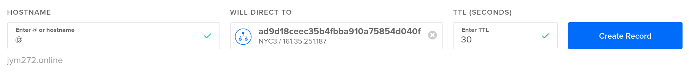
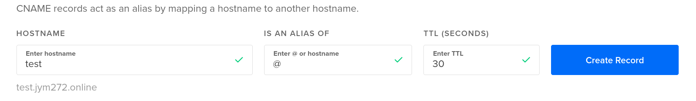

**Contents**
1. [Create Infrastructure of Digital Ocean](#create-infrastructure-of-digital-ocean)
   1. [Create a Cluster](#create-a-cluster)
   2. [Install nginx and cert-manager](#install-nginx-and-cert-manager)
   3. [Manage DNS Records](#manage-dns-records)
   4. [Create Sealed Secrets](#create-sealed-secrets)
   5. [Securing the Ingress Using Cert-Manager](#securing-the-ingress-using-cert-manager)
   6. [Volumes](#volumes)
2. [Resources](#resources)
   1. [Create](#create)
   2. [Delete](#delete)


## Create Infrastructure of Digital Ocean
### Create a Cluster
- Create a cluster- > use the [console](https://cloud.digitalocean.com/login). Default options are fine, only select scale type `Autoscale`.
- Connect, the context is added in kubectl config
    ```bash
  doctl kubernetes cluster kubeconfig save e53a7675-fc4c-48de-ac38-a3e99adbfXXX
   ```
### Install nginx and cert-manager
Follow the [tutorial](https://www.digitalocean.com/community/tutorials/how-to-set-up-an-nginx-ingress-on-digitalocean-kubernetes-using-helm).

To install the Nginx Ingress Controller to your cluster, you’ll first need to add its repository to Helm by running:
```bash
helm repo add ingress-nginx https://kubernetes.github.io/ingress-nginx
```
Update your system to let Helm know what it contains:
```bash
helm repo update
```
Finally, run the following command to install the Nginx ingress:
```bash
helm install nginx-ingress ingress-nginx/ingress-nginx --set controller.publishService.enabled=true
```
Run this command to watch the Load Balancer become available, `EXTERNAL-IP` must appear:
```bash
kubectl --namespace default get services -o wide -w nginx-ingress-ingress-nginx-controller
```
### Manage DNS Records
Add a domain in `Networking` tab in Digital Ocean console, then, direct the hostname to the lb.


Create some subdomains.


Wait for the subdomains to be available. [check propagation of domains](https://www.whatsmydns.net/#CNAME/)

### Create Sealed Secrets
For secrets management `sealed-secrets` is used.
Follow the
[instructions.](../../../scripts/README.md#using-sealedsecrets-for-secret-management)


### Securing the Ingress Using Cert-Manager
Deploy infrastructure for cert-manager:
```bash
kubectl apply -k k8s/overlay/digitalOcean/  
# comment the line cert-manager.io/cluster-issuer: letsencrypt-prod
kubectl apply -f k8s/overlay/digitalOcean/ingress.yaml
```

[Cert Manager nginx doc](https://cert-manager.io/docs/tutorials/acme/nginx-ingress/)
Before installing Cert-Manager to your cluster via Helm, you’ll create a namespace for it:
```bash
kubectl create namespace cert-manager
```
You'll need to add the Jetstack Helm repository to Helm, which hosts the Cert-Manager chart. To do this, run the following command:
```bash
helm repo add jetstack https://charts.jetstack.io && helm repo update
```
Finally, install Cert-Manager into the cert-manager namespace by running the following command, 
use [last version](https://artifacthub.io/packages/helm/cert-manager/cert-manager)
```bash
helm install cert-manager jetstack/cert-manager --namespace cert-manager --version v1.11.1 --set installCRDs=true
```
In order to begin issuing certificates,
you will need to set up a `ClusterIssuer`. 
[documentation](https://cert-manager.io/docs/configuration/)

```yaml
# production_issuer.yaml
apiVersion: cert-manager.io/v1
kind: ClusterIssuer
metadata:
  name: letsencrypt-prod
spec:
  acme:
    # Email address used for ACME registration
    email: jym272@gmail.com
    server: https://acme-v02.api.letsencrypt.org/directory
    privateKeySecretRef:
      # Name of a secret used to store the ACME account private key
      name: letsencrypt-prod-private-key
    # Add a single challenge solver, HTTP01 using nginx
    solvers:
      - http01:
          ingress:
            class: nginx
```
Roll it out with `kubectl`:
```bash
kubectl apply -f production_issuer.yaml
```
Finally, uncomment the `cert-manager.io/cluster-issuer: letsencrypt-prod` line in `ingress.yaml`
and apply it.
```bash
kubectl apply -f ingress.yaml
```
Once the `ingress.yaml` file is updated, You’ll need to wait a few minutes for the Let’s Encrypt 
servers to issue a certificate for your domains. In the meantime, you can track progress 
by inspecting the output of the following command:
```bash
# The secretName must be different for every Ingress you create.
# in ingress.yaml -> secretName: hello-kubernetes-tls
kubectl describe certificate hello-kubernetes-tls
# inspect the challenges
kubectl get challenges.acme.cert-manager.io -o wide
kubectl get certificate
```

Wait for **The certificate has been successfully issued** message. 
If it fails or take more than 10 minutes, review the `domains` and the ingress file, you can change
the name of `secretName`in ingress.

[More info and troubleshooting](https://cert-manager.io/docs/troubleshooting/acme/),

### Volumes
For information about volumes in Digital Ocean, follow the [tutorial](./tutorials/README.md).

## Resources
### Create
```bash
kubectl apply -k k8s/overlay/digitalOcean/  
# uncomment cert-manager.io/cluster-issuer: letsencrypt-prod line only if you have a valid certificate
kubectll apply -f k8s/overlay/digitalOcean/ingress.yaml
```
### Delete
**Volumes** are created, these need to be deleted manually.
When `nginx` is created a `LoadBalancer` is created, this needs to be deleted manually.
```bash
kubectl delete -k k8s/overlay/digitalOcean/
kubectl delete -f k8s/overlay/digitalOcean/ingress.yaml
# The pvc are dynamically created by StatefulSet, so you need to delete them manually
kubectl delete pvc auth-claim-db-auth-0 nats-claim-nats-0 orders-claim-db-orders-0 payments-claim-db-payments-0 tickets-claim-db-tickets-0 redis-claim-redis-0
# The LB also needs to be deleted manually
helm uninstall nginx-ingress
```
